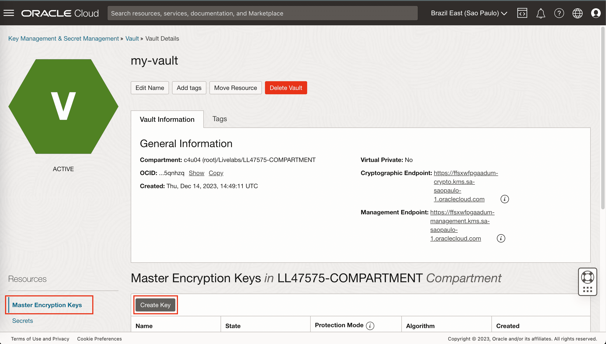
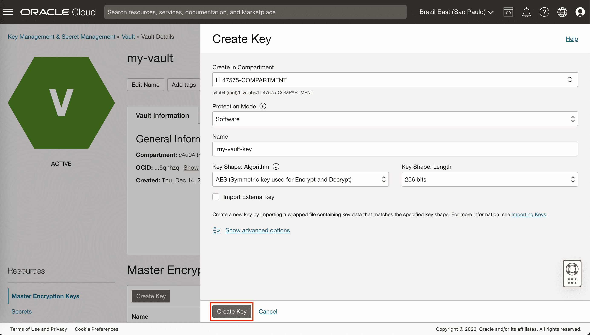
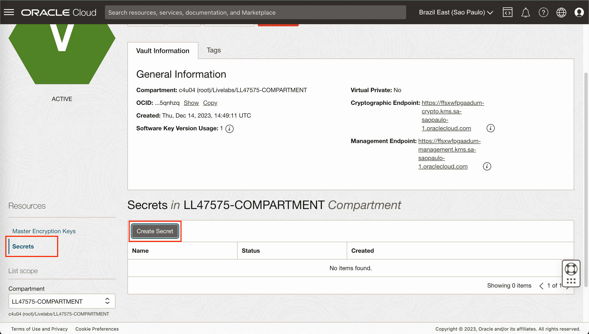
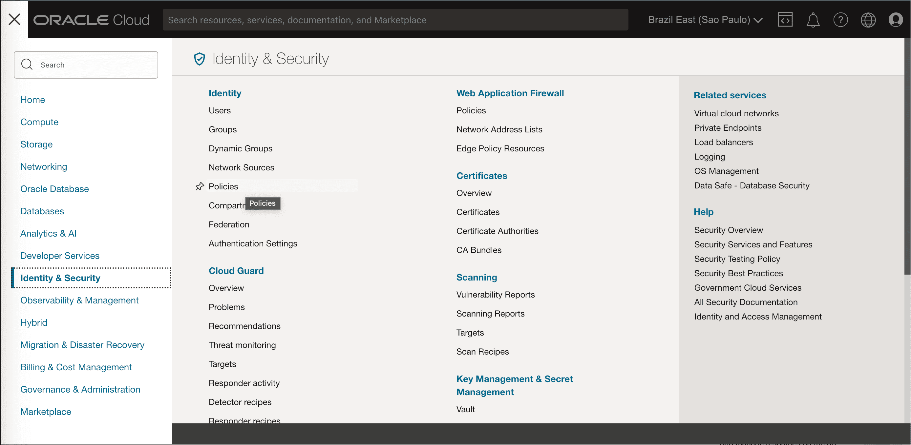
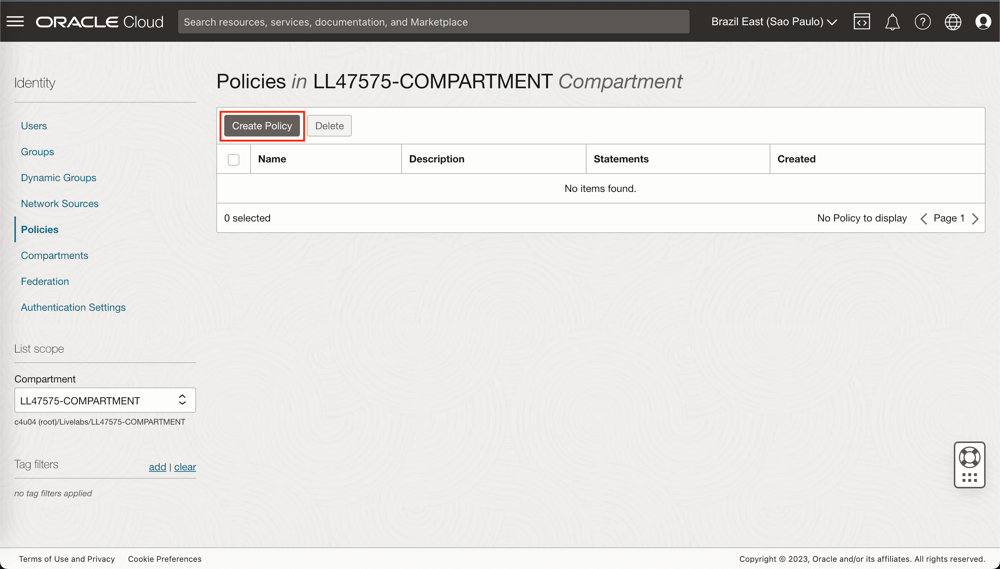
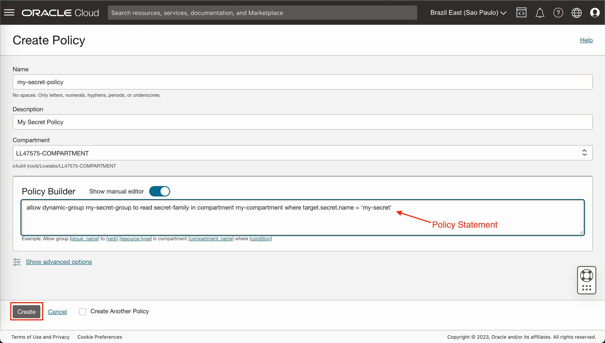
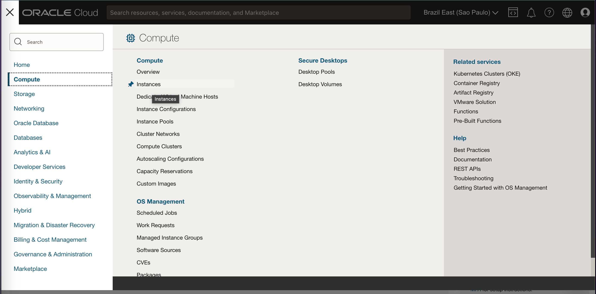
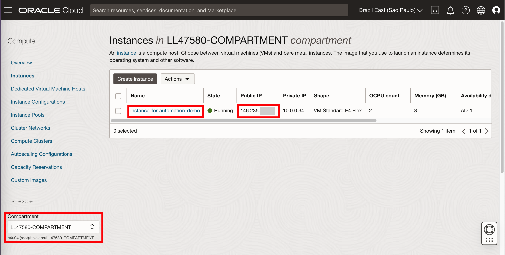

# Developer Persona and Proper Credentials Management with OCI Vault

## Introduction

In Lab 3, return as a developer persona to discover the secure realm of OCI Vault. Learn the importance of proper credentials management as we guide you through leveraging OCI Vault to securely store and access credentials, ensuring a robust and resilient approach to security.

Estimated Time: 1 hour 30 minutes

### Objectives

In this lab, you will:

- Learn the importance of secure credential management in OCI.
- Utilize OCI Vault to securely store and manage credentials.
- Understand the proper workflow of accessing credentials from OCI Vault and applying them to interact with REST APIs.

### Prerequisites

This lab assumes you have:

- Some understanding of cloud terms
- Familiarity with Oracle Cloud Infrastructure OCI would be helpful.

## Task 1: Oracle Cloud Infrastructure Vault - Overview

Oracle Cloud Infrastructure Vault is a management service that stores and manages master encryption keys and secrets for secure access to resources.

The below video gives an overview of OCI key management service and its key concepts.

   [
      
   ](https://www.youtube.com/watch?v=Yhm9eCP_SOA)

By utilizing OCI Vault, you can effectively manage and control access to secrets within your OCI environment. The Vault service offers robust security features, including encryption at rest and in transit, access controls, auditing capabilities, and integration with other OCI services.

## Task 2: Create a Dynamic Group

A Dynamic Group is a group that dynamically grant access to resources based on a rule. Our Dynamic Group will be used with a matching rule to determine which instances we want to allow API calls against the service we are going to use.

Use the following steps to create a dynamic group.

> Note: Keep in mind that the Dynamic Group is already created for you in the Sandbox environment, so you wouldn't need to create it.

1. Login to the OCI Console
2. Go to Menu > Identity & Security > Dynamic Groups
3. Click the Create Dynamic Group button
    
4. Enter the following:
    - Name: `my-secret-group`
    - Description: `My Secret Dynamic Group`
    - Rule: `any {instance.compartment.id = '<ocid_compartment>'}`
    - NOTE: Where `<ocid_compartment>` is the ocid of the target compartment.
5. Click the Create Dynamic Group button to save
    

## Task 3: Create a Vault

We will now create a Vault in the target compartment, then add a key that will be used to encrypt a new secret. The secret could be anything, but for our example we will store a API-token. Note that you could add multiple secrets if needed. Using the following steps to create a vault, a key, and a secret.

1. Login to the OCI Console
2. Go to Menu > Identity & Security > Vault
    
3. Select the target compartment
4. Click the Create Vault button
5. Enter the following:
    - Name:  `my-vault`
6. Click Create Vault button to save
    
7. Click on the `my-vault` that was just created
8. Click on the Keys link under Resources
    
9. Click Create Key button
10. Enter a Name for the key (e.g. `my-vault-key`)
11. Select 256 bits from the Key Shape
12. Click Create Key button to save
    
13. Click on the Secrets link under Resources
14. Click Create Secret button
15. Enter the following:
      - Name: `my-secret`
      - Description: `My Secret`
      - Encryption Key: select `my-vault-key` created earlier
      - Secret Contents: `<my secret here>`
16. Click Create Secret button
    
17. Click on the secret `my-secret`
    
18. Copy the secret OCID to be used next.

## Task 4: Create a Policy using the Dynamic Group

After you have created a dynamic group, you need to create policy to permit the dynamic groups to access OCI services.

The below policy statement allows all instances in the dynamic group `my-secret-group` to access the secret `my-secret`.

> Note: Better policy to only access a specific secret

``` txt
allow dynamic-group my-secret-group to read secret-family in compartment my-compartment where target.secret.name = 'my-secret'
```

Use the following steps to create a the policy:

> Note: Keep in mind that the Policy is already created for you, in the Sandbox environment, so you wouldn't need to create it.

1. Login to the OCI Console
2. Go to Menu > Identity & Security> Policies
    
3. Click the Create Policy button
    
4. Enter the following:
    - Name: `my-secret-policy`
    - Description: `My Secret Policy`
    - Statements :
        - `allow dynamic-group my-secret-group to read secret-family in compartment my-compartment where target.secret.name = 'my-secret'`
5. Click the Create button to save
    

## Task 5: Retrieve the secret from the Compute Instance

Finally, we can create a script to retrieve our secret. The following steps creates a Python script that you can use as a framework to build on, but this could also be done in other languages that are supported such as Java, Ruby, and Go — [Software Development Kits and Command Line Interface](https://docs.cloud.oracle.com/en-us/iaas/Content/API/Concepts/sdks.htm). Use the following steps to create a Python script with the given example.

1. Login to the OCI Console
2. Go to Menu > Computes > Instances
    
3. Select the correct compartment
4. Copy the public IP
    
5. Open a Shell session and run the below command

    ``` bash
    ssh opc@<instance-public-ip>
    ```

6. Create a file.

    ``` bash
    vim get-secret.py
    ```

7. Press `i` and paste in the following Python script.

    ``` python
    #!/usr/bin/python3
    # coding: utf-8
    # COPYRIGHT (c) 2023 ORACLE

    import oci
    import base64
    import sys

    # Replace secret_id value below with the ocid of your secret
    secret_id = "ocid1.vaultsecret.oc1.<my_secret_ocid>"

    # By default this will hit the auth service in the region the instance is running.
    signer = oci.auth.signers.InstancePrincipalsSecurityTokenSigner()

    # In the base case, configuration does not need to be provided as the region and tenancy are obtained from the InstancePrincipalsSecurityTokenSigner
    identity_client = oci.identity.IdentityClient(config={}, signer=signer)

    # Get instance principal context
    secret_client = oci.secrets.SecretsClient(config={}, signer=signer)

    # Retrieve secret
    def read_secret_value(secret_client, secret_id):
        response = secret_client.get_secret_bundle(secret_id)
        base64_Secret_content = response.data.secret_bundle_content.content
        base64_secret_bytes = base64_Secret_content.encode('ascii')
        base64_message_bytes = base64.b64decode(base64_secret_bytes)
        secret_content = base64_message_bytes.decode('ascii')
        return secret_content

    # Print secret
    secret_contents = read_secret_value(secret_client, secret_id)
    print(format(secret_contents))
    ```

8. Be sure to change the `secret_id` ocid in the `get-secret.py` script with your secret, then save and exit.
9. Make the `get-secret.py` script executable.

    ``` bash
    chmod +x get-secret.py
    ```

10. Run the following command to magically return the secret.  

    ``` bash
    ./get-secret.py

    <my secret here>
    ```

## Learn More

- [OCI Vault](https://docs.oracle.com/en-us/iaas/Content/KeyManagement/Concepts/keyoverview.htm)
- [Managing Dynamic Groups](https://docs.oracle.com/en-us/iaas/Content/Identity/Tasks/managingdynamicgroups.htm)
- [Policy](https://docs.oracle.com/en-us/iaas/Content/Identity/Concepts/policygetstarted.htm)

## Acknowledgements

- **Author**
    - Andrea Romano, Senior Research Manager, Oracle Labs
- **Contributors**
    - Rhicheek Patra, Research Director, Oracle Labs
    - El Houcine Es Sanhaji, Member of Technical Staff, Oracle Labs
    - Robin Vaaler, Senior Member of Technical Staff,  Oracle Labs
- **Last Updated By/Date**
    - El Houcine Es Sanhaji, 12 2023
